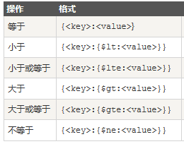

客户端工具 mongoVUE

##命令行

这是js???
```
> db
test
> db.getName
function (){
    return this._name;
}
> db.getName()
test
> db.getName.toString()
function (){
    return this._name;
}
> db
test
> typeof db
object
> Object.prototype.toString.call(db)
[object DB]
```

- 查看所有数据库 

```
show dbs

201609blog    0.078GB
admin         (empty)
local         0.078GB
mongodb-test  0.078GB
```

- 使用数据库

```
use <database-name>
```

- 查看当前使用的数据库

```
db 或者 db.getName()

test
```

- 删除当前正在使用的数据库

```
db.dropDatabase()
```

- 查看帮助

```
db.worker.help()
```

- 查看数据库下的集合

```
show collections

article
sessions
system.indexes
user
```

## 创建数据库

```
use <db-name> //直接use就行 切换也是use
```

## 创建Collection

```
db.createCollection(<collection-name>)
```

## 插入文档

```
db.<collection-name>.insert(<document>)
db.<collection-name>.save(<document>)
```

每当插入一条新文档的时候mongodb会自动为此文档生成一个_id属性,_id一定是唯一的，用来唯一标识一个文档 
_id也可以直接指定，但如果数据库中此集合下已经有此_id的话插入会失败
如果不指定 _id 字段 save() 方法类似于 insert() 方法。如果指定 _id 字段，则会更新该 _id 的数据。


##修改文档

```
db.test.update(
    {age: 1},
    {$set:{gender: 1}},
    {multi: true}     // 加上这个 修改所有匹配到的 不加只修改第一个匹配到的
)
```

## 删除文档

```
db.test.remove({age: 1}) // 删除匹配到的所有
db.test.remove({age: 1}, 1) // 删除匹配到的第一个
```


## 查询文档

```
db.<colletion-name>.find({})
db.<colletion-name>.find({<queryWhere>},{<key1>:1, <key2>:1})
db.<colletion-name>.findOne()
db.<colletion-name>.find({<key>:{$gt:<value>}})   // 
```




## 分页查询

- limit 

```
db.<colletion-name>.find().limit(<number>)
```

- skip

```
db.<colletion-name>.find().skip(<number>)
```